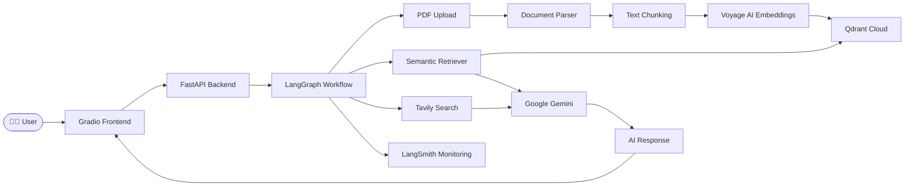
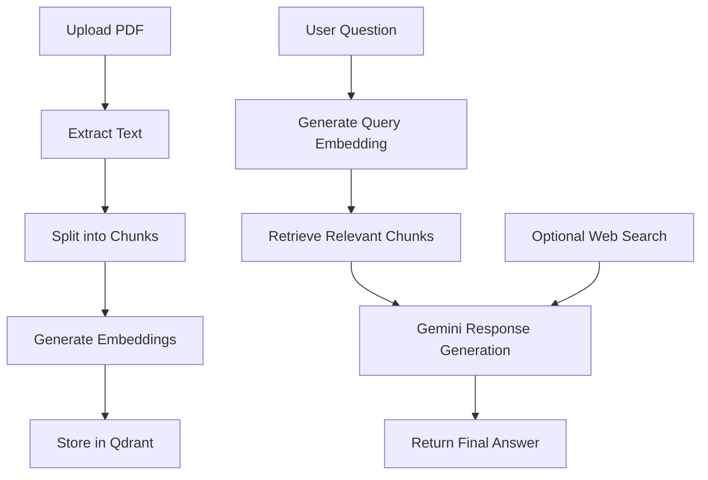
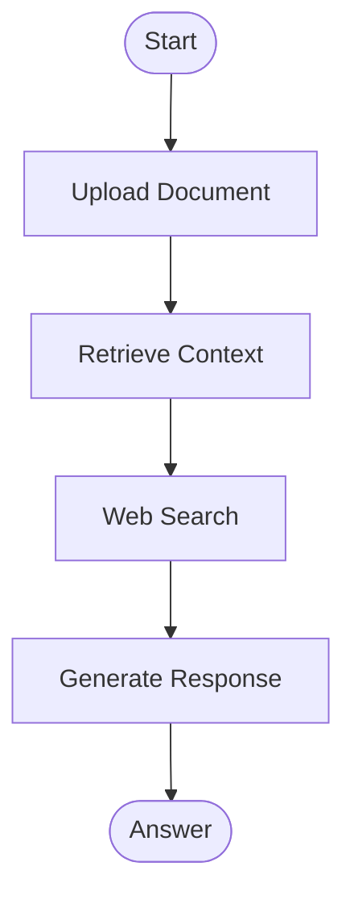
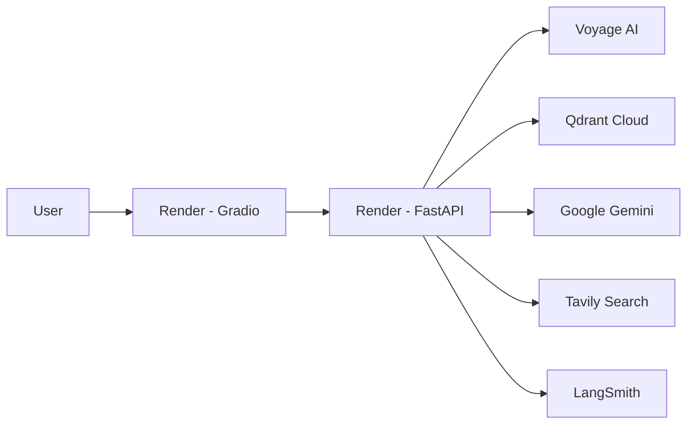

<div align="center">

<p align="center">
  
</p>

<h1 align="center">📚 Learnova – AI-Powered Study Assistant</h1>

<p align="center">
An Intelligent Retrieval-Augmented Generation (RAG) Platform for Smarter Learning
</p>

### *An Intelligent Retrieval-Augmented Generation (RAG) Platform for Smarter Learning*

<p align="center">
  Learnova combines Retrieval-Augmented Generation (RAG), semantic search, web search, and Large Language Models to help students interact with their study materials through natural conversations.
</p>

<p align="center">


</p>

</div>

<p align="center">

<a href="#overview">Overview</a> •
<a href="#features">Features</a> •
<a href="#architecture">Architecture</a> •
<a href="#installation">Installation</a> •
<a href="#deployment">Deployment</a> •
<a href="#api-documentation">API</a>

</p>


---

# 🌟 Overview

Learnova is an AI-powered study assistant designed to transform static learning materials into an interactive conversational experience.

Instead of simply sending a user's question to a Large Language Model, Learnova follows a Retrieval-Augmented Generation (RAG) pipeline. It first retrieves the most relevant information from uploaded study materials using semantic vector search and then combines that retrieved context with Google Gemini to generate accurate, context-aware responses.

When local study material is insufficient, Learnova intelligently extends its knowledge through live web search, ensuring students receive comprehensive and up-to-date answers.

The platform emphasizes factual grounding, contextual understanding, and educational assistance while minimizing hallucinations commonly associated with standalone LLMs.

---


## 📊 Project Metrics

| Metric | Value |
|---------|------:|
| Language | Python |
| Architecture | RAG |
| LLM | Gemini |
| Embedding Model | Voyage AI |
| Vector Database | Qdrant Cloud |
| Workflow Engine | LangGraph |
| Backend | FastAPI |
| Frontend | Gradio |
| Deployment | Docker + Render |


# 🎯 Problem Statement

Students frequently encounter several challenges while studying from digital resources:

- Reading lengthy PDF documents is time-consuming.
- Searching for specific concepts manually is inefficient.
- Traditional keyword-based search often misses semantic meaning.
- General-purpose AI models may generate inaccurate or hallucinated answers without proper context.
- Study materials become difficult to navigate as their size increases.

These issues reduce learning efficiency and make revision significantly more difficult.

---

# 💡 Solution

Learnova addresses these challenges through a Retrieval-Augmented Generation (RAG) architecture that combines semantic search with Large Language Models.

The system:

- Extracts text from uploaded PDF documents.
- Splits documents into meaningful semantic chunks.
- Generates high-dimensional vector embeddings using Voyage AI.
- Stores embeddings inside Qdrant Cloud.
- Retrieves only the most relevant document chunks for every user query.
- Enhances responses using Google Gemini.
- Performs live web search through Tavily whenever external knowledge is beneficial.
- Presents responses through an intuitive conversational Gradio interface.

The result is an AI assistant capable of delivering contextually grounded, explainable, and highly relevant educational responses.

---

# 🚀 Live Deployment


## Backend API

https://learnova-backend-s5n2.onrender.com

REST API powering the complete RAG workflow.

---

## Frontend

https://learnova-frontend.onrender.com

Interactive Gradio interface for document upload and conversational question answering.

---

## API Documentation

https://learnova-backend-s5n2.onrender.com/docs

Interactive Swagger documentation for testing every backend endpoint.


### 🌐 Live Demo

| Service | Link |
|---------|------|
| 🎨 Frontend | https://learnova-frontend.onrender.com |
| ⚙ Backend | https://learnova-backend-s5n2.onrender.com |
| 📘 Swagger API | https://learnova-backend-s5n2.onrender.com/docs |

---

# ✨ Key Features

## 📄 Intelligent Document Processing

- Upload academic PDF documents
- Automatic text extraction
- Intelligent document chunking
- Configurable chunk size and overlap
- Efficient preprocessing pipeline

---

## 🧠 Semantic Retrieval

- Voyage AI Embeddings
- Context-aware similarity search
- High-quality semantic retrieval
- Qdrant Cloud vector database
- Fast nearest-neighbor search

---

## 🤖 AI-Powered Question Answering

- Google Gemini integration
- Context-aware response generation
- Natural conversational interaction
- Reduced hallucination through RAG
- Educational explanations

---

## 🌐 Intelligent Web Search

- Tavily Search integration
- Live information retrieval
- Combines external knowledge with uploaded documents
- Improves response completeness

---

## ⚡ Advanced Workflow Orchestration

- LangGraph state management
- Modular workflow nodes
- Conditional execution paths
- Scalable architecture
- Maintainable pipeline design

---

## 📈 Monitoring & Observability

- LangSmith tracing
- Workflow visualization
- Request monitoring
- Debugging support
- Execution analytics

---

## 🐳 Deployment Ready

- Dockerized backend
- Dockerized frontend
- Docker Compose support
- Cloud deployment on Render
- Environment-based configuration

---

# 🎓 Primary Objectives

The primary objectives of Learnova are:

- Improve learning efficiency.
- Provide conversational access to study material.
- Minimize hallucinations using Retrieval-Augmented Generation.
- Demonstrate production-ready AI engineering practices.
- Showcase modern LLM application architecture.
- Build a scalable educational AI platform.

---

# 🏆 Highlights

✔ Retrieval-Augmented Generation (RAG)

✔ Google Gemini Integration

✔ Voyage AI Embeddings

✔ Qdrant Cloud Vector Database

✔ LangGraph Workflow Orchestration

✔ Tavily Web Search

✔ LangSmith Monitoring

✔ FastAPI REST Backend

✔ Gradio Frontend

✔ Dockerized Architecture

✔ Render Cloud Deployment

✔ Production-Ready Project Structure

---

> **Learnova demonstrates how modern Large Language Models, semantic retrieval, vector databases, workflow orchestration, and cloud-native deployment can be combined to build an accurate, scalable, and practical AI-powered educational assistant.**


# 🏗️ System Architecture

Learnova follows a modular Retrieval-Augmented Generation (RAG) architecture designed for scalability, maintainability, and production deployment.

The application is divided into multiple independent layers responsible for document processing, semantic retrieval, AI reasoning, workflow orchestration, and user interaction.



---

# 🔄 Complete RAG Workflow

The following diagram illustrates how Learnova processes every user query.



---

# ⚙️ LangGraph Workflow

Instead of implementing a single linear pipeline, Learnova uses LangGraph to orchestrate multiple intelligent workflow nodes.



Each workflow node is responsible for a specific task, allowing the application to remain modular and easy to extend.

---

# 📚 Document Processing Pipeline

Uploaded study material undergoes multiple preprocessing stages before becoming searchable.

```text
PDF Upload
      │
      ▼
Text Extraction
      │
      ▼
Cleaning & Normalization
      │
      ▼
Document Chunking
      │
      ▼
Embedding Generation
      │
      ▼
Vector Storage
```

Every uploaded document is transformed into semantic vectors that can later be retrieved using similarity search.

---

# 💬 Question Answering Pipeline

Whenever a student asks a question, Learnova performs the following operations.

```text
User Question
      │
      ▼
Generate Query Embedding
      │
      ▼
Search Similar Chunks
      │
      ▼
Retrieve Relevant Context
      │
      ▼
(Optional) Tavily Web Search
      │
      ▼
Merge Context
      │
      ▼
Google Gemini
      │
      ▼
Final Response
```

This Retrieval-Augmented Generation approach significantly improves factual accuracy while reducing hallucinations.

---

# 🛠️ Technology Stack

| Layer | Technology | Purpose |
|---------|------------|---------|
| Programming Language | Python | Core development |
| Frontend | Gradio | Interactive user interface |
| Backend | FastAPI | REST API development |
| Workflow | LangGraph | AI workflow orchestration |
| LLM | Google Gemini | Response generation |
| Embedding Model | Voyage AI | Semantic vector embeddings |
| Vector Database | Qdrant Cloud | High-performance vector storage |
| Search Engine | Tavily | Live web search |
| Monitoring | LangSmith | Tracing & debugging |
| Containerization | Docker | Reproducible deployment |
| Cloud Platform | Render | Hosting backend & frontend |

---

# 📂 Project Structure

```text
Learnova
│
├── backend
│   │
│   ├── api/
│   ├── config/
│   ├── models/
│   ├── services/
│   ├── workflows/
│   ├── utils/
│   ├── uploads/
│   ├── main.py
│   ├── requirements.txt
│   ├── Dockerfile
│   └── .env
│
├── frontend
│   │
│   ├── ui.py
│   ├── config.py
│   ├── requirements.txt
│   └── Dockerfile
│
├── docker-compose.yml
├── README.md
├── LICENSE
└── .gitignore
```

---

# 🧩 Core Components

## Frontend

The Gradio frontend provides an intuitive conversational interface where users can:

- Upload study material
- Ask natural language questions
- View AI-generated answers
- Interact with retrieved document context

---

## Backend

The FastAPI backend exposes REST endpoints that handle:

- Document uploads
- PDF processing
- Vector indexing
- Semantic retrieval
- AI inference
- Health monitoring

---

## Vector Database

Qdrant Cloud stores semantic embeddings generated using Voyage AI.

The vector database enables:

- Similarity search
- Context retrieval
- Low-latency semantic queries
- Scalable document indexing

---

## Large Language Model

Google Gemini generates the final response using:

- Retrieved document context
- User question
- External web search (when applicable)

This combination produces contextually grounded answers with significantly reduced hallucinations.

---

# 🌐 Deployment Architecture



---

# 🎯 Design Principles

Learnova has been designed with the following engineering principles:

- Modular architecture
- Separation of concerns
- Scalable workflow orchestration
- Cloud-native deployment
- API-first design
- Environment-based configuration
- Production-ready Docker containers
- Maintainable project structure
- Extensible RAG pipeline
- Observable AI workflows using LangSmith


# 🚀 Getting Started

This section explains how to set up and run Learnova in different environments, including local development, Docker, and cloud deployment.

---

# 📋 Prerequisites

Before running the project, ensure the following software is installed on your system.

| Software | Version |
|-----------|----------|
| Python | 3.12+ |
| Git | Latest |
| Docker | Latest |
| Docker Compose | Latest |
| VS Code (Recommended) | Latest |

---

# 📥 Clone the Repository

```bash
git clone https://github.com/bhavanibeemanpalli2108/Learnova.git

cd Learnova
```

---

# ⚙️ Local Installation

## 1. Create a Virtual Environment

### Windows

```bash
python -m venv venv

venv\Scripts\activate
```

### Linux / macOS

```bash
python3 -m venv venv

source venv/bin/activate
```

---

## 2. Install Backend Dependencies

```bash
cd backend

pip install -r requirements.txt
```

---

## 3. Install Frontend Dependencies

```bash
cd ../frontend

pip install -r requirements.txt
```

---

# 🔐 Environment Variables

Create a `.env` file inside the `backend` directory.

```text
backend/
│
└── .env
```

Add the following environment variables.

| Variable | Description |
|------------|-------------|
| APP_NAME | Application name |
| APP_VERSION | Application version |
| DEBUG | Debug mode |
| GEMINI_API_KEY | Google Gemini API key |
| GEMINI_MODEL | Gemini model name |
| VOYAGE_API_KEY | Voyage AI API key |
| EMBEDDING_MODEL | Voyage embedding model |
| QDRANT_URL | Qdrant Cloud URL |
| QDRANT_API_KEY | Qdrant API key |
| QDRANT_COLLECTION | Collection name |
| LANGSMITH_API_KEY | LangSmith API key |
| LANGSMITH_PROJECT | LangSmith project |
| LANGSMITH_ENDPOINT | LangSmith endpoint |
| LANGSMITH_TRACING | Enable tracing |
| TAVILY_API_KEY | Tavily Search API key |
| UPLOAD_DIRECTORY | Upload folder |
| MAX_FILE_SIZE_MB | Maximum upload size |
| CHUNK_SIZE | Chunk size |
| CHUNK_OVERLAP | Chunk overlap |

> Never commit your `.env` file to GitHub.

---

# ▶ Running the Backend

Navigate to the backend directory.

```bash
cd backend
```

Run the FastAPI server.

```bash
uvicorn main:app --reload
```

Backend will be available at

```
http://127.0.0.1:8000
```

Swagger documentation

```
http://127.0.0.1:8000/docs
```

---

# ▶ Running the Frontend

Navigate to the frontend directory.

```bash
cd frontend
```

Run the Gradio application.

```bash
python ui.py
```

Frontend will be available at

```
http://127.0.0.1:7860
```

---

# 🐳 Docker Deployment

Learnova is fully containerized using Docker.

---

## Build Containers

```bash
docker compose build
```

---

## Start Containers

```bash
docker compose up
```

---

## Start in Detached Mode

```bash
docker compose up -d
```

---

## Stop Containers

```bash
docker compose down
```

---

# ☁️ Cloud Deployment

Learnova is deployed using **Render**.

## Backend

```
https://learnova-backend-s5n2.onrender.com
```

---

## Frontend

```
https://learnova-frontend.onrender.com
```

---

# 📖 API Documentation

Interactive Swagger documentation is available at

```
https://learnova-backend-s5n2.onrender.com/docs
```

---

# 📡 REST API Endpoints

## Health Check

```
GET /api/v1/health
```

Checks backend availability.

---

## Upload Document

```
POST /api/v1/upload
```

Uploads a PDF document and stores semantic embeddings in Qdrant.

---

## Chat

```
POST /api/v1/chat
```

Accepts a natural language query and returns an AI-generated response.

---

# 🔄 API Workflow

```text
Client Request

↓

FastAPI

↓

LangGraph Workflow

↓

Retrieve Context

↓

(Optional) Tavily Search

↓

Gemini

↓

Return Response
```

---

# ⚙ Configuration

The application uses environment-based configuration.

No source code modifications are required to switch between:

- Local Development
- Docker
- Render Deployment

Configuration is controlled entirely through environment variables.

---

# 📦 Docker Images

The repository contains separate Dockerfiles for each service.

```
backend/Dockerfile

frontend/Dockerfile
```

This allows independent deployment of the frontend and backend.

---

# 🩺 Health Monitoring

Backend Health Endpoint

```
GET /api/v1/health
```

Used by:

- Render Health Checks
- Frontend Connectivity
- Deployment Verification

---

# 🧪 Testing the Deployment

After deployment, verify the following.

✅ Backend Health Endpoint

✅ Swagger Documentation

✅ Frontend Loads Successfully

✅ PDF Upload Works

✅ Embeddings Generated

✅ Qdrant Storage Successful

✅ Semantic Retrieval Works

✅ Gemini Response Generated

✅ LangSmith Trace Created

---

# 📈 Monitoring

Learnova integrates LangSmith for workflow observability.

LangSmith enables:

- Prompt tracing
- Node execution visualization
- Latency analysis
- Workflow debugging
- Request inspection

This significantly improves debugging and production monitoring.

---

# 🔒 Security Considerations

To keep deployments secure:

- Store secrets only in environment variables.
- Never commit `.env` files.
- Rotate API keys if exposed.
- Restrict API keys to the minimum required permissions.
- Keep Docker images updated.
- Disable debug mode in production.

# 🚀 Getting Started

This section explains how to set up and run Learnova in different environments, including local development, Docker, and cloud deployment.

---

# 📋 Prerequisites

Before running the project, ensure the following software is installed on your system.

| Software | Version |
|-----------|----------|
| Python | 3.12+ |
| Git | Latest |
| Docker | Latest |
| Docker Compose | Latest |
| VS Code (Recommended) | Latest |

---

# 📥 Clone the Repository

```bash
git clone https://github.com/bhavanibeemanpalli2108/Learnova.git

cd Learnova
```

---

# ⚙️ Local Installation

## 1. Create a Virtual Environment

### Windows

```bash
python -m venv venv

venv\Scripts\activate
```

### Linux / macOS

```bash
python3 -m venv venv

source venv/bin/activate
```

---

## 2. Install Backend Dependencies

```bash
cd backend

pip install -r requirements.txt
```

---

## 3. Install Frontend Dependencies

```bash
cd ../frontend

pip install -r requirements.txt
```

---

# 🔐 Environment Variables

Create a `.env` file inside the `backend` directory.

```text
backend/
│
└── .env
```

Add the following environment variables.

| Variable | Description |
|------------|-------------|
| APP_NAME | Application name |
| APP_VERSION | Application version |
| DEBUG | Debug mode |
| GEMINI_API_KEY | Google Gemini API key |
| GEMINI_MODEL | Gemini model name |
| VOYAGE_API_KEY | Voyage AI API key |
| EMBEDDING_MODEL | Voyage embedding model |
| QDRANT_URL | Qdrant Cloud URL |
| QDRANT_API_KEY | Qdrant API key |
| QDRANT_COLLECTION | Collection name |
| LANGSMITH_API_KEY | LangSmith API key |
| LANGSMITH_PROJECT | LangSmith project |
| LANGSMITH_ENDPOINT | LangSmith endpoint |
| LANGSMITH_TRACING | Enable tracing |
| TAVILY_API_KEY | Tavily Search API key |
| UPLOAD_DIRECTORY | Upload folder |
| MAX_FILE_SIZE_MB | Maximum upload size |
| CHUNK_SIZE | Chunk size |
| CHUNK_OVERLAP | Chunk overlap |

> Never commit your `.env` file to GitHub.

---

# ▶ Running the Backend

Navigate to the backend directory.

```bash
cd backend
```

Run the FastAPI server.

```bash
uvicorn main:app --reload
```

Backend will be available at

```
http://127.0.0.1:8000
```

Swagger documentation

```
http://127.0.0.1:8000/docs
```

---

# ▶ Running the Frontend

Navigate to the frontend directory.

```bash
cd frontend
```

Run the Gradio application.

```bash
python ui.py
```

Frontend will be available at

```
http://127.0.0.1:7860
```

---

# 🐳 Docker Deployment

Learnova is fully containerized using Docker.

---

## Build Containers

```bash
docker compose build
```

---

## Start Containers

```bash
docker compose up
```

---

## Start in Detached Mode

```bash
docker compose up -d
```

---

## Stop Containers

```bash
docker compose down
```

---

# ☁️ Cloud Deployment

Learnova is deployed using **Render**.

## Backend

```
https://learnova-backend-s5n2.onrender.com
```

---

## Frontend

```
https://learnova-frontend.onrender.com
```

---

# 📖 API Documentation

Interactive Swagger documentation is available at

```
https://learnova-backend-s5n2.onrender.com/docs
```

---

# 📡 REST API Endpoints

## Health Check

```
GET /api/v1/health
```

Checks backend availability.

---

## Upload Document

```
POST /api/v1/upload
```

Uploads a PDF document and stores semantic embeddings in Qdrant.

---

## Chat

```
POST /api/v1/chat
```

Accepts a natural language query and returns an AI-generated response.

---

# 🔄 API Workflow

```text
Client Request

↓

FastAPI

↓

LangGraph Workflow

↓

Retrieve Context

↓

(Optional) Tavily Search

↓

Gemini

↓

Return Response
```

---

# ⚙ Configuration

The application uses environment-based configuration.

No source code modifications are required to switch between:

- Local Development
- Docker
- Render Deployment

Configuration is controlled entirely through environment variables.

---

# 📦 Docker Images

The repository contains separate Dockerfiles for each service.

```
backend/Dockerfile

frontend/Dockerfile
```

This allows independent deployment of the frontend and backend.

---

# 🩺 Health Monitoring

Backend Health Endpoint

```
GET /api/v1/health
```

Used by:

- Render Health Checks
- Frontend Connectivity
- Deployment Verification

---

# 🧪 Testing the Deployment

After deployment, verify the following.

✅ Backend Health Endpoint

✅ Swagger Documentation

✅ Frontend Loads Successfully

✅ PDF Upload Works

✅ Embeddings Generated

✅ Qdrant Storage Successful

✅ Semantic Retrieval Works

✅ Gemini Response Generated

✅ LangSmith Trace Created

---

# 📈 Monitoring

Learnova integrates LangSmith for workflow observability.

LangSmith enables:

- Prompt tracing
- Node execution visualization
- Latency analysis
- Workflow debugging
- Request inspection

This significantly improves debugging and production monitoring.

---

# 🔒 Security Considerations

To keep deployments secure:

- Store secrets only in environment variables.
- Never commit `.env` files.
- Rotate API keys if exposed.
- Restrict API keys to the minimum required permissions.
- Keep Docker images updated.
- Disable debug mode in production.